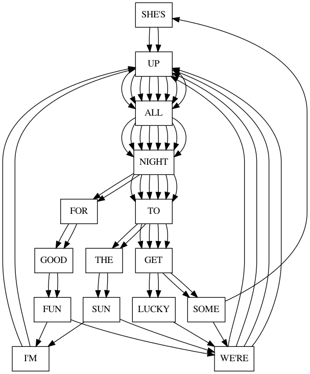
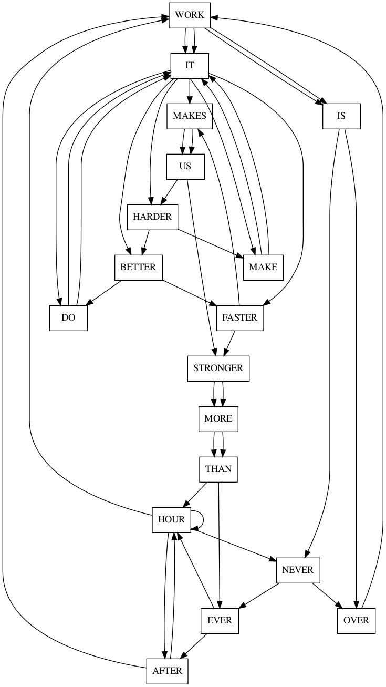

# song-grapher

Turns song lyrics into graphs

## Step 0 - install software

You will need [Ruby](https://www.ruby-lang.org/en/downloads/) and [Graphviz](https://graphviz.org/download/) installed

## Step 1 - Add your lyrics

Put lyrics into `song.txt`

## Step 2 - Run the grapher

    ruby song-grapher.png

## Step 3 - ???

Your song will be graphed in `song.png`

## Step 4 - PROFIT!

Examples:

### Get Lucky

### Harder, Better, Faster, Stronger

## License

MIT license: do what you want with it, but I offer no support and I accept no responsibility for the software. I will consider pull reqeusts.
